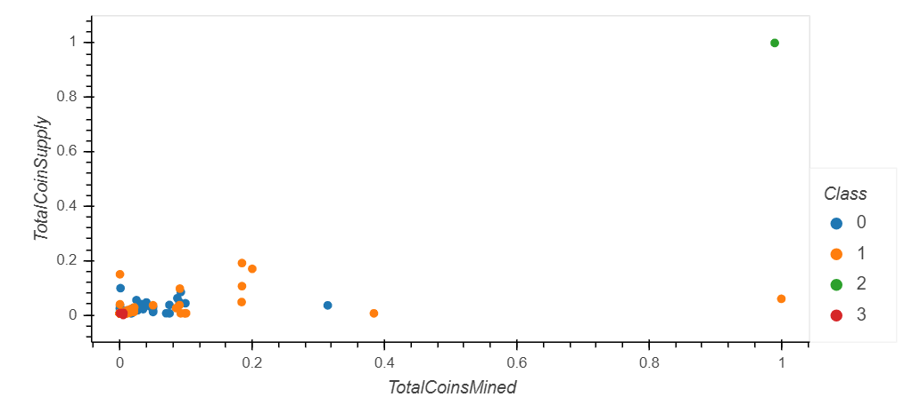

# Cryptocurrencies - Unsupervised learning
This project to understand unsupervied learning and apply it to analyse the cryptocurrencies. In this project we will be using crypto_data.csv file. crypto_data.csv file has data which is not relevant we will be cleaning the data using pandas. Using StandadScalar we are scaling the data. PCA model is used to fit the data and using Kmean we defining clusters. Clusters and k we are defining a dataframe and lotting Elbow curve to get the desirable K value. With K we are making predictions and additing 'class' column to the generated principal componants dataframe. Finally we will combine all dataframes to get final dataframe with columns Algorithm, ProofType,TotalCoinsMined,TotalCoinSupply, PC 1, PC 2,PC 3, CoinName, and Class and generate 3D plot. Also we will create a data table with all the current tradable cryptocurrencies. Finally we will reate a scatter plot to present the clustered data about cryptocurrencies having x="TotalCoinsMined" and y="TotalCoinSupply" to contrast the number of available coins versus the total number of mined coins. 

### DataFrame from file crypto_data.csv

### DataFrame after cleaning the data steps 1-7

### DataFrame after standardizing and PCA step 8-9

### Elbow Curve

### Kmean from PCA

### New DataFrame with Algorithm, ProofType, TotalCoinsMined, TotalCoinSupply, PC 1, PC 2, PC 3, CoinName, and Class

### 3D plot

### Data table with all the current tradable cryptocurrencies

### Scatter plot

